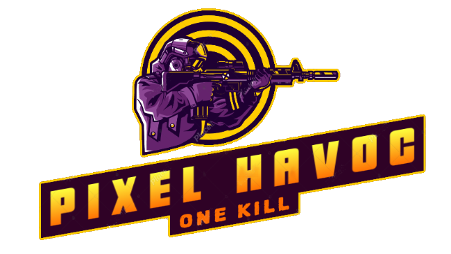

# Pixel-Havoc
  
Pixel-Havoc is a multiplayer game developed in C# using Unity. The primary focus of the project was to implement a custom networking solution utilizing both UDP and TCP for communication, rather than relying on third-party networking libraries.

## Features

- **Custom Multiplayer Implementation** – Uses UDP for fast-paced gameplay updates and TCP for reliable data transmission.
- **Pixel Art Style** – A dynamic and engaging visual aesthetic.
- **Smooth Real-Time Networking** – Optimized message handling for an improved multiplayer experience.
- **Peer-to-Peer Hosting** – One player acts as the host, serving as both the server and a participant in the game.
- **Lobby System** – The host creates a lobby using a dedicated button, allowing other players to join via IP.
- **Cross-Platform Support** – Compatible with Windows and potentially other platforms supported by Unity.

## Technology Stack

- **Engine:** Unity
- **Programming Language:** C#
- **Networking Protocols:** UDP & TCP (Custom Implementation)

## Running the Game

### Hosting a Game
To host a game, a player needs to create a lobby using the dedicated button in the game menu. This initiates the server functionality and allows other players to connect.

### Joining a Game
Players can connect by entering the host player’s IP address and port within the game’s connection menu.

